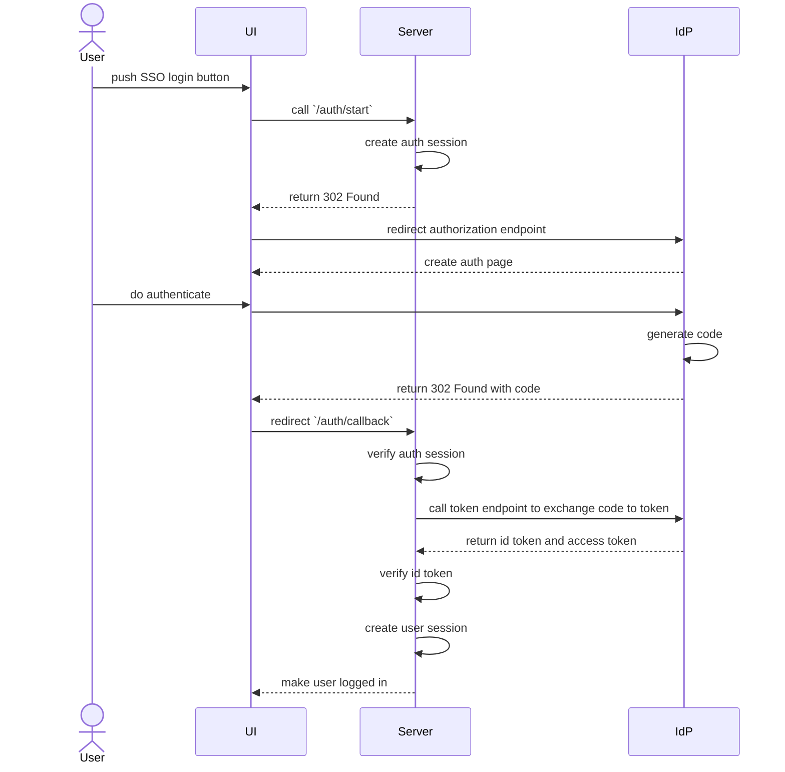

```mermaid
sequenceDiagram
	actor User
	participant UI
	participant Server
	participant IdP
	
	User ->> UI: push SSO login button
	UI ->> Server: call `/auth/start`
	Server ->> Server: create auth session
	Server -->> UI: return 302 Found
	UI ->> IdP: redirect authorization endpoint
	IdP -->> UI: create auth page
	User ->> UI: do authenticate
	UI ->> IdP: 
	IdP ->> IdP: generate code
	IdP -->> UI: return 302 Found with code
	UI ->> Server: redirect `/auth/callback`
	Server ->> Server: verify auth session
	Server ->> IdP: call token endpoint to exchange code to token
	IdP -->> Server: return id token and access token
	Server ->> Server: verify id token
	Server ->> Server: create user session
	Server -->> UI: make user logged in
```